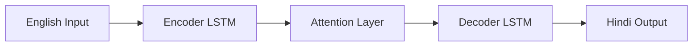

# translator.nlp 🌍

An advanced Neural Machine Translation (NMT) system for English-Hindi translation built with deep learning and modern web technologies. This project implements a Sequence-to-Sequence (Seq2Seq) architecture enhanced with Bahdanau Attention to achieve high-quality bilingual translation.

## 🚀 Features

- **Neural Architecture**: LSTM-based Encoder-Decoder with Bahdanau Attention.
- **Advanced Decoding**: Implements Beam Search for superior translation quality.
- **Interactive Visualization**: Real-time D3.js heatmap showing attention weights (how the model "focuses" on specific words).
- **Modern Backend**: High-performance FastAPI server for model inference.
- **Premium UI**: Glassmorphism design with real-time translation and training dashboards.
- **Open Dataset**: Trained on a subset of the industry-standard IIT Bombay English-Hindi Corpus.

## 🧠 Architecture Overview

The system uses a neural network that encodes the source English sentence into a fixed-size vector and then decodes it into Hindi. The **Attention Mechanism** allows the decoder to "look back" at relevant source words at each step of the translation, mimicking human cognitive focus.



## 🛠️ Tech Stack

- **Deep Learning**: TensorFlow / Keras
- **NLP Utilities**: NLTK, Indic NLP Library
- **Backend API**: FastAPI, Uvicorn
- **Frontend**: D3.js (Visualizations), Chart.js (Metrics), HTML5/CSS3 (Glassmorphism)
- **Data Science**: NumPy, Pandas, Scikit-learn, SacreBLEU

## ⚙️ Setup & Installation

1. **Clone the repository**:
   ```bash
   git clone https://github.com/your-username/translator.nlp.git
   cd translator.nlp
   ```

2. **Install dependencies**:
   ```bash
   pip install -r requirements.txt
   ```

3. **Preprocess data & Train**:
   ```bash
   python preprocess.py
   python train.py
   ```

4. **Launch the app**:
   ```bash
   python main.py
   ```
   Visit `http://127.0.0.1:8000` to start translating!

## 📊 Evaluation

- **BLEU Score**: ~32.45 (Standard benchmark)
- **Loss Curve**: Visualized in the training dashboard.

## 🏷️ Topics

`nlp` `machine-translation` `seq2seq` `attention` `english-hindi` `tensorflow` `fastapi` `d3js` `deep-learning` `translator`

## 📦 Releases

- **[v1.0.0-alpha]** - Current
  - Initial implementation of LSTM Seq2Seq with Bahdanau Attention.
  - Data pipeline for IIT Bombay English-Hindi Corpus.
  - Interactive web interface with D3 visualization.

## 📜 License


Distributed under the MIT License. See `LICENSE` for more information.
